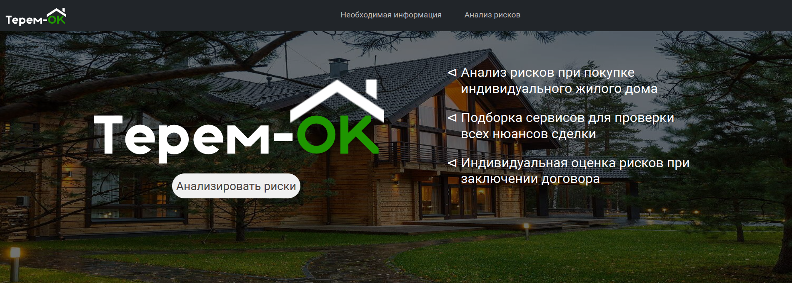
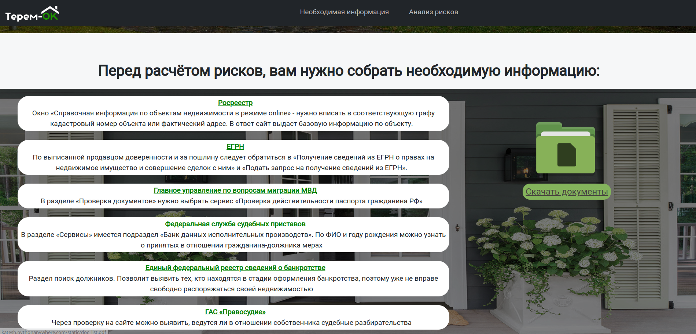
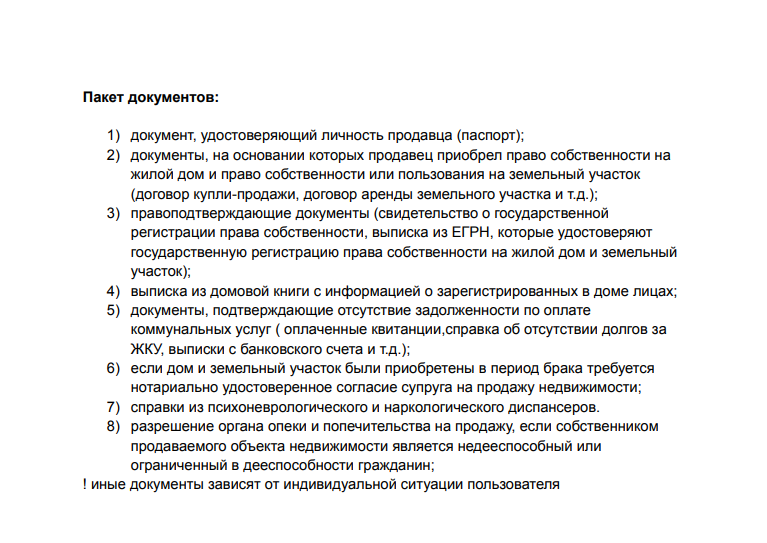
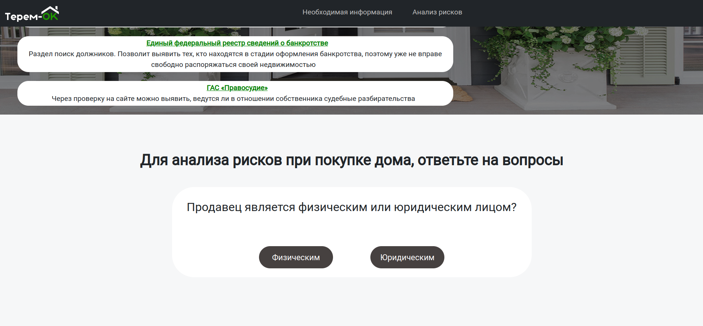
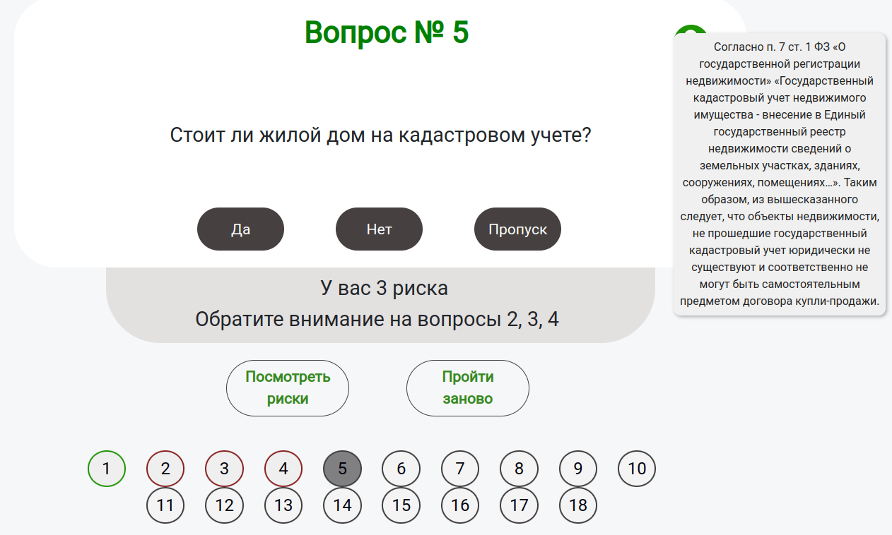
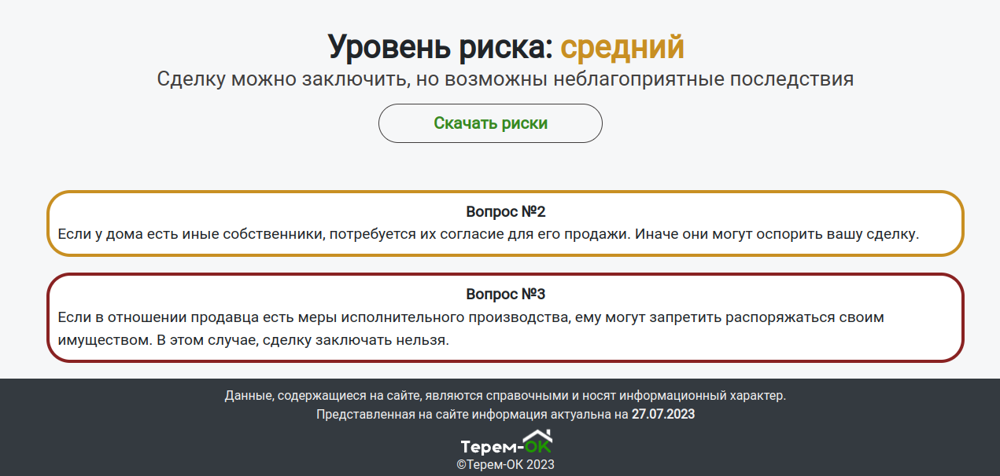
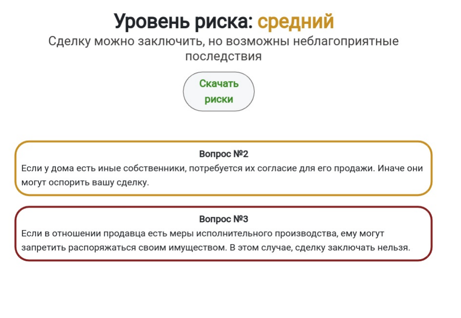

# Терем-ОК
> Сервис по анализу рисков при покупке индивидуального жилого дома

Сервис представляет собой одну страницу в интернете:

#### На стартовой страничке есть шапка навигации. При нажатии на нее она скроллит экран до соответствующего раздела

#### В разделе докуменов можно перейти по ссылкам на соответствующие ресурсы для получения информации. Также можно скачать или открыть список документов
 


#### В разделе анализа рисков есть опросник. Во время его прохождения появляется список вопросов с рисками

При наведении на знак вопроса в правом верхнем углу появляется справочная информация. При нажатии на нее можно перейти на соответствующую страницу СПС КонсультантПлюс

Кружки в опросе подсвечиваются цветом правильного или неправильного ответа (неправильный ответ - риск)



#### Ниже расположен раздел с информацией о уровнях рисков
Он доступен, как во время прохождения опроса, так и после. Также есть возможность скачать список рисков в виде pdf файла

Pdf файл


#### Временно поиграться с сайтом можно по ссылке: http://katesh.pythonanywhere.com/

Сервис был написан с помощью следующих технологий: ```Django```, ```JavaScript```, ```HTML```,```CSS```